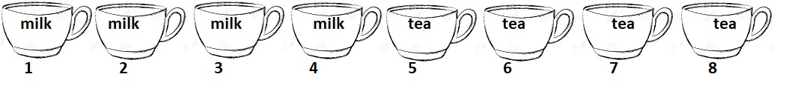

```{r setup, include=FALSE}
###this is a code chunk. you can write code here

###setting global option to echo all code chunks, unless
###otherwise specified in chunk options
knitr::opts_chunk$set(echo = TRUE)

###attach R packages which may be needed
library(openintro)    #contains R function for drawing probability tree

```


* * * 
\begin{shaded}

\textbf{Learning Outcomes}

The problems are designed to build conceptual understanding and problem-solving skills. The emphasis is on learning to find, evaluate and build confidence.
The specific tasks include: 

   - Enumerate and count
   
   - Apply Bayes' rule
   
   - Calculate probabilities for independent events
  
   - Back up and support work with relevant explanations


\end{shaded}

* * *

### Exercises 

1.  (*Lady Tasting Tea*) In a famous experiment conducted by Sir. R. A. Fisher, 8 cups of tea - 4 prepared by pouring the milk first and then the tea and 4 prepared by pouring the tea first and then the milk -- were  presented in random order to Muriel Bristol who claimed she could tell the difference. 

    The methods employed in the experiment were fully disclosed to the subject and she had to select the 4 cups prepared with the "milk poured first". 

```{r teacups, echo=F, fig.align = "center", out.width="85%"}
#including an image file

```

a. The sample space $S$ for this experiment consists of all groupings of 4 cups selected from eight. How many such groups are there? Write your answer symbolically first and also calculate it in the code chunk below.
    
    We have 8 total objects from which we want to select 4.
    This is $\binom{8}{4}$.
  
    ```{r count_s}
    #calculate number of elements in S
    ## in the code chunk below
    
    S_card <- choose(8,4)
    S_card
 
    ```
  
b. Let $E$ denote the event that there are 3 cups with "milk poured first" and 1 cup with "tea poured first". How many elements are in $E$? Write your answer symbolically first and also calculate it in a code chunk below.
    
    Of four cups, we want all the possibilities that there are 3 with milk and
    one with tea first.
    This is $\binom{4}{3}*\binom{4}{1}$.
    
    ```{r count_e}
    #calculate number of elements in S
    
    E_card <- choose(4,3) * choose(4,1)
    E_card
    
    ```

c. If the lady has no ESP and is just guessing randomly, it is reasonable to assume that every outcome in $S$ is equally likely. Calculate $P(E)$ under this assumption. You may do this in a code chunk.

    ```{r p_of_E}
    
    p_of_E <- E_card/S_card
    p_of_E
    
    ```
    
2. One common application of conditional probabilities is in calculating inverse probabilities. For example, consider the following tree diagram of probabilities relating a screening test for a disease with the actual presence of disease. 


    ```{r treediagram, echo = FALSE}

    treeDiag(main = c("Disease status", "Test result"),
         p1 = c(0.001, 0.999),
         p2 = list(c(0.98, "?"), c(0.01, "?")),
         out1 = c("Present", "Absent"),
         out2 = c("Positive", "Negative"),
         showSol = FALSE,
         showWork = FALSE,
         solwd = 0.5,
         digits = 6)

    ```

    Let $D_1$ denote that a randomly selected individual has the disease, and $D_2$ denote the event that they are healthy. Further suppose $T$ is the event that the screening test is positive 

    The first (primary) branch of the tree gives \emph{unconditional} probabilities of disease being present or absent, while the secondary branches state conditional probabilities of the test coming out positive (or negative) given the disease status. For example, you are given that
$P(T|D_1) = 0.98$.

a. Fill in the values in the tree diagram indicated by a "?"  

    ```{r treediagram_filled_in, echo = FALSE}

    treeDiag(main = c("Disease status", "Test result"),
         p1 = c(0.001, 0.999),
         p2 = list(c(0.98, 0.02), c(0.01, 0.99)),
         out1 = c("Present", "Absent"),
         out2 = c("Positive", "Negative"),
         showSol = FALSE,
         showWork = FALSE,
         solwd = 0.5,
         digits = 6)

    ```

b. Suppose the test is positive. What is the probability that the person actually has disease? In other words, find the inverse conditional probability: $P(D_1|T)$

    By Bayes Theorem,
    \begin{align*}
        P(D_1|T) &= \frac{ P(T|D_1)\cdot P(D_1) }{ P(T) }\\
                 &= \frac{ 0.98 \cdot  0.001}{ P(T) }
    \end{align*}
    
    We need to calculate P(T). We can calculate this by adding $P(D_1\cap T)$ 
    and $P(D_2\cap T)$. We have 
    \begin{align*}
        P(T) &=  P(D_1\cap T) + P(D_2\cap T)\\
            &= P(T|D_1)\cdot P(D_1) + P(T|D_2)\cdot P(D_2)\\
            &= 0.98 \cdot 0.001 + 0.01\cdot 0.999
    \end{align*}
    
    ```{r p_of_t}
        p_of_t <- 0.98*0.001 + 0.01*0.999
        p_of_d1_given_t <- (0.98*0.001)/p_of_t
        p_of_d1_given_t
    ```
    
3. Suppose that string of tree lights you just bought has twenty-four bulbs
wired in series. If each bulb has a 99.9% chance of “working” when the current
is applied, what is the probability that the string itself will not work? You may assume that bulb failures are independent.

    In addition to writing up your steps, create a new code chunk below and do your calculations there. Be sure to print the result.
    
    We need the probability that one bulb will fail, since this will cause the string itself to not work. Let $A_i = P(\text{bulb i works})$. The event the string works, that is, all the bulbs work, be written as $B=A_1\cap A_2\cap \ldots\cap A_{24}$. Since each bulb is independent, we have
    \begin{align*}
        P(B) = \prod_{i=1}^{24}P(A_i)=0.999^{24}
    \end{align*}
    
    Then, the probability that the string will not work is $B^c$. Then we have $P(B^c)=1-P(B)$
    
    ```{r p_of_B}
        p_of_B <- 0.999^{24}
        B_compliment <- 1-p_of_B
        B_compliment
    ```
    
    
    
    
    
    
    
    